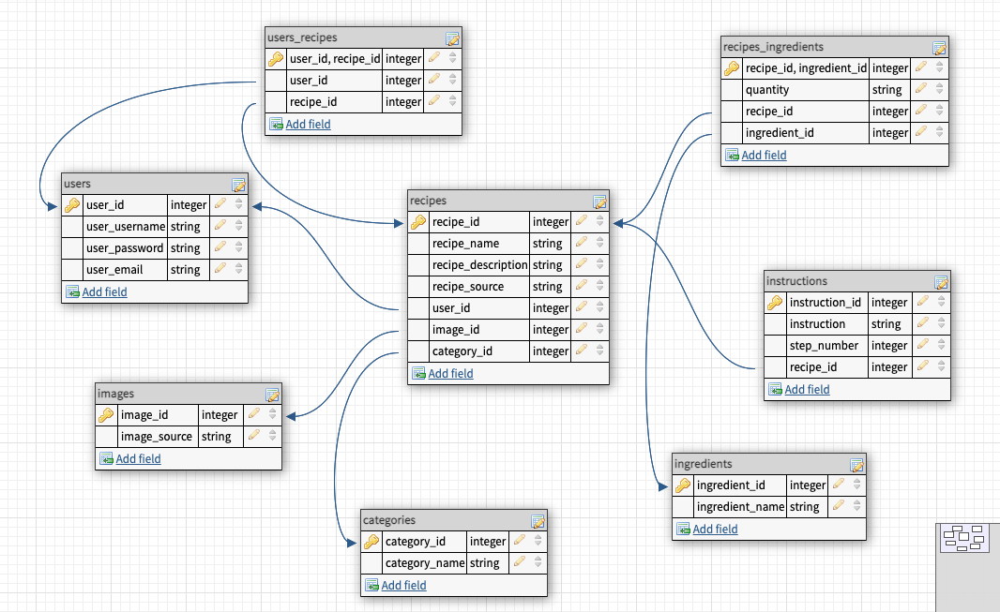

# Endpoints

## USERS Endpoints

[POST] REGISTER: https://secret-family-recipes-101.herokuapp.com/api/users/register  
[POST] LOGIN: https://secret-family-recipes-101.herokuapp.com/api/users/login  

## User Requirements:

Register = user_username, user_email, user_password
    ** user_username & user_email must be unique **

Login = user_username, user_password

## RECIPE Endpoints

[GET] ALL RECIPES: https://secret-family-recipes-101.herokuapp.com/api/recipes   
[GET] RECIPE BY ID: https://secret-family-recipes-101.herokuapp.com/api/recipes/:id  
[POST] RECIPE: https://secret-family-recipes-101.herokuapp.com/api/recipes  
[PUT] RECIPE: https://secret-family-recipes-101.herokuapp.com/api/recipes/:id  
[DELETE] RECIPE: https://secret-family-recipes-101.herokuapp.com/api/recipes/:id  

## MY-LIST Endpoints

[GET] MyList: https://secret-family-recipes-101.herokuapp.com/api/recipes/my-list  
[POST] Recipe to MyList: https://secret-family-recipes-101.herokuapp.com/api/recipes/my-list/:id  
[DELETE] Recipe from MyList: https://secret-family-recipes-101.herokuapp.com/api/recipes/my-list/:id  

## Recipe Categories:

1 = Breakfast  
2 = Lunch  
3 = Beverages  
4 = Appetizers   
5 = Soups  
6 = Salads  
7 = Main dishes: Beef  
8 = Main dishes: Poultry  
9 = Main dishes: Pork  
10 = Main dishes: Seafood  
11 = Main dishes: Vegetarian  
12 = Side dishes: Vegetables  
13 = Side dishes: Other  
14 = Desserts  
15 = Canning / Freezing  
16 = Breads  
17 = Holidays  
18 = Entertaining  

## Recipe Schema:
```
{
  "recipe_name": "enter recipe name",  
  "recipe_description": "enter recipe description",
  "recipe_source": "enter recipe source",
  "user_id": 1,
  "image_source": "enter image url",
  "category_id": 2,
  "ingredients": [
    {
      "ingredient_name": "beef",
      "quantity": "not sure but it is a lot"
    },
    {
      "ingredient_name": "tester three food",
      "quantity": "so much more"
    }
  ],
  "instructions": [
    {
      "instruction": "mix it together",
      "step_number": 1
    },
    {
      "instruction": "mix it even more",
      "step_number": 2
   },
   {
      "instruction": "bake it please",
      "step_number": 3
   }
  ]
}
```
